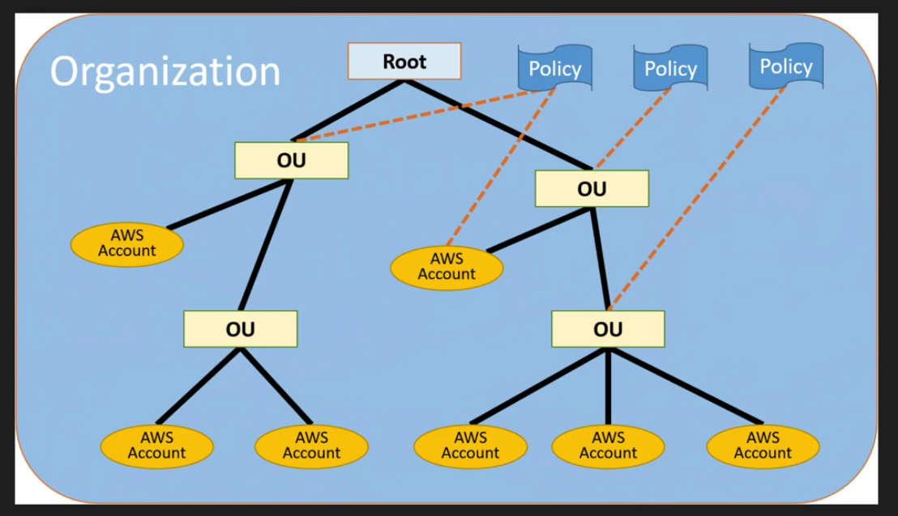

# AWS Organizations

two types:
* all features (policies, etc)
* only consolidated billing

##  consolidated billing

- 20 linked accounts max (could be increased)
- one bill per AWS account
- east to track charges and allocate costs
- volume pricing discounts
- reserved EC2 instances (could use RI in other accounts)

Cloudtrail:
- per AWS account & is per region
- can consolidate logs using an S3 bucket

## Service Control Policies