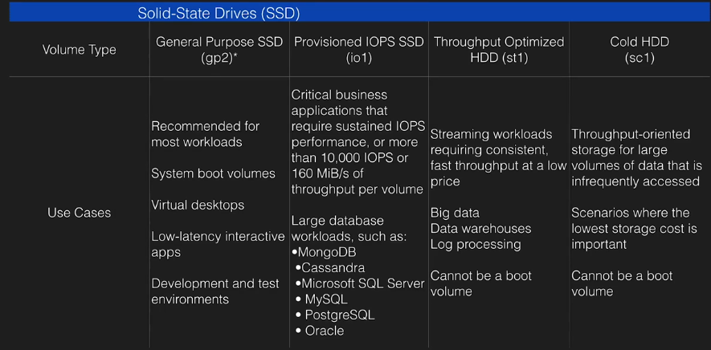
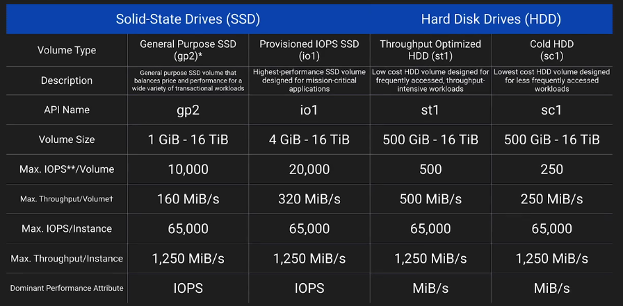

# EBS

- EBS are placed in a specific AZ, where they are automatically replicated. (Not to different AZ, but between SANs)
- cannot mount to multiple instances
- EC2 and EBS volume have to be in the same AZ
- can't modify standard volume, can change volume size and storage type on the fly

### Bootable:
- Magentic standard (bootable)
- GP2
- IO1

### Volume types

- GP2, general purpose SSD
    * 3 IOPS per GB with up to 10k IOPS, burst up to 3k IOPS
- Provisioned IOPS SSD (IO1)
    * I/O intensive
    * if you need >10k IOPS
    * provision up to 20k IOPS
- Throughput optimized HDD (ST1)
    * big data
    * data warehouses
    * Log processing
    * sequential data
    * cannot be a boot volume
- Cold HDD (SC1)
    * low cost
    * file server
    * cannot be a boot volume
- Magnetic (Standard)
    * bootable
    * lowest cost





### Bursting

I/O Credits

when required more than the baseline performance I/O, EBS will use I/O credits to burst performance level, up to 3k IOPS

- 5400000 I/O credits initially
- enough for 3k IOPS for 30 minuntes
- earn credits when not going over provisioned IO level

### Snapshots

- snapshots exist on S3
- snapshots are point in time copies of volumes
- snapshots are incremental
- you can create AMIs from volumes and snapshots
- to move EC2 volume from one AZ/region to another - take a snap or an image, then copy it to the new region
- snaps of encrypted volumes are encrypted automatically
- volumes restored from encrypted snapshots are encrypted automatically
- you can share snapshots, but only unecrypted
    * snap can be shared with other AWS accounts or made public
- snapshot for root EBS volumes -> stop the instance before taking the snapshot

### Instance store

- Ephemeral storage
- can't stop. If the underlying host fails - will lose data
- EBS backed can be stopped
- Can reboot both


## Pre-warming EBS volumes

Restoring volumes from snapshots -> read all block from volume before using -> pre-warming

## Cloudwatch metrics

- Read|Write Byets
- Read|Write Ops
- Total Read|Write Time
- IdeTime
- *QueueLength* - number of IO waiting to be completed
- ThroughputPercentage
- ConsumedReadWriteOps

## Status checks

- ok
- warning
    ```
    (severely) degraded, but available
    ```
- impaired (stalled/not available)
    ```
    volume offline/pending recovery, or waiting for the user to enable I/O

    ```
- insufficient-data

## Modifying EBS volumes

- online size change
- change volume type or adjust IOPS performance

----------

## Links

- https://docs.aws.amazon.com/AWSEC2/latest/UserGuide/Storage.html
- https://docs.aws.amazon.com/AWSEC2/latest/UserGuide/monitoring-volume-status.html
- https://docs.aws.amazon.com/AWSEC2/latest/UserGuide/ebs-initialize.html