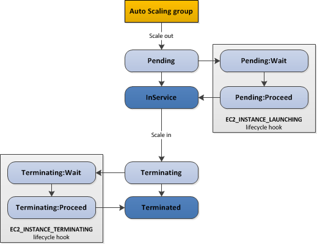

# Autoscaling life-cycle hooks

50 hooks per group maximum


After you add lifecycle hooks to your Auto Scaling group, they work as follows:
- Responds to scale out events by launching instances and scale in events by terminating instances.
- Puts the instance into a wait state (`Pending:Wait` or `Terminating:Wait`). The instance is paused until either you continue or the timeout period ends.
- You can perform a custom action using one or more of the following options:
    - Define a CloudWatch Events target to invoke a Lambda function when a lifecycle action occurs. The Lambda function is invoked when Amazon EC2 Auto Scaling submits an event for a lifecycle action to CloudWatch Events. The event contains information about the instance that is launching or terminating, and a token that you can use to control the lifecycle action.
    - Define a notification target for the lifecycle hook. Amazon EC2 Auto Scaling sends a message to the notification target. The message contains information about the instance that is launching or terminating, and a token that you can use to control the lifecycle action.
    - Create a script that runs on the instance as the instance starts. The script can control the lifecycle action using the ID of the instance on which it runs.
- By default, the instance remains in a wait state for one hour, and then the Auto Scaling group continues the launch or terminate process (`Pending:Proceed` or `Terminating:Proceed`). If you need more time, you can restart the timeout period by recording a heartbeat. If you finish before the timeout period ends, you can complete the lifecycle action, which continues the launch or termination process.



## Wait State

- default timeout is 1 hour, max is 48 hours or 100 times * heartbeat timeout, whichever is smaller.
- adjust timeout with:
     - heartbeat timeout for hook when creating hook. Use `put-lifecycle-hook` command with `--heartbeat-timeout` parameter. Or use `PutLifecycleHook` op with `HeartbeatTimeout` param.
     - Continue to the next state with `complete-lifecycle-action` command or the `CompleteLifecycleAction` operation.
     - Restart timeout period by recording a heartbeat, using `record-lifecycle-action-heartbeat` command or the `RecordLifecycleActionHeartbeat` op. This increments the heartbeat timeout by the timeout value specified when you created the lifecycle hook. If the timeout is 1 hour, and you call this comamand after 30 minutes, the instance remains in a wait state for an additional hour.

## Cooldowns and custom actions

The cooldown period is a configurable setting for your Auto Scaling group that helps to ensure that it doesn't launch or terminate additional instances before the previous scaling activity takes effect. After the Auto Scaling group dynamically scales using a simple scaling policy, it waits for the cooldown period to complete before resuming scaling activities.

Default cooldown is 300 seconds (5 minutes)

`scale out -> hoook -> 'Pending:Wait' -> scaling actions are suspended -> 'InService' -> cooldown starts -> resume scaling actions after cooldown
`

## Health Check

Health check grace period doesn't start until you complete the lifecycle hook and the instance enters the `InService` state.

## Action result

### Continue

Launching: success, can be put into service.
Terminating: both ABANDON and CONTINUE allow instance to terminate, continue allows other lifecycle hooks to complete.

### Abandon

Launching: actions were unsuccessful, instance can be terminated
Terminating: stops any remaining actions, such as other lifecycle hooks

## Spot Instances

hook doesn't prevent an instance from terminating due to a change in spot price. You must still complete lifecycle action.

## Notifications

- Cloudwatch events
- SNS
- SQS

## Enter and Exit Standby
```
aws autoscaling enter-standby
aws autoscaling exit-standby
```

- Instance in an InService state can be moved toStandby state.
- Standby state enables you to remove the instance from service, troubleshoot or make changes to it, and then put it back into service.
- Instances in a Standby state continue to be managed by the Auto Scaling group. However, they are not an active part of the application until they are put back into service.