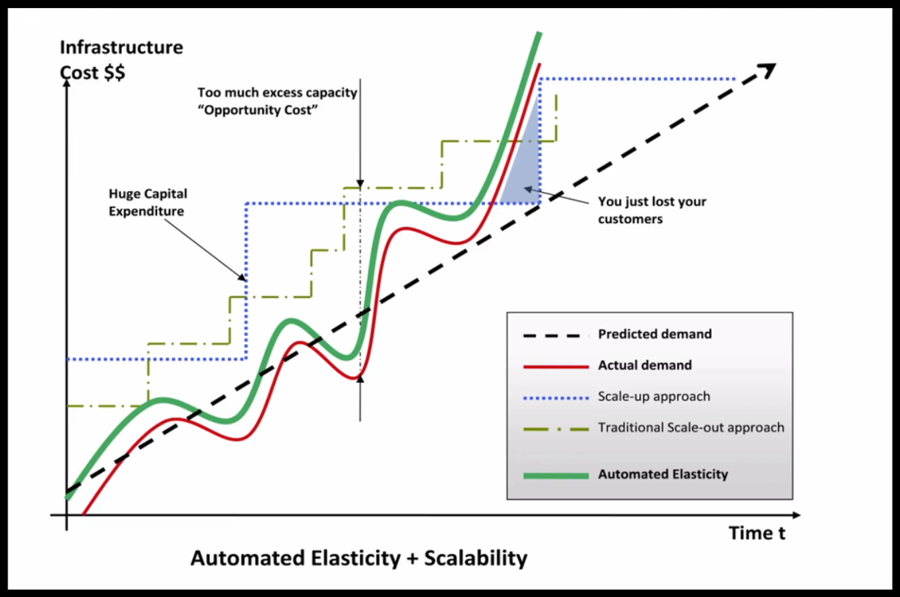
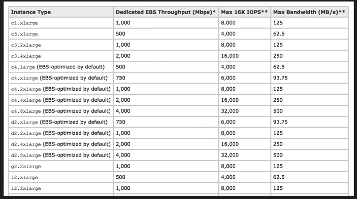

# Elasticity vs Scalability

Elasticity - scaling out
- increase number of EC2 instances, based on autoscaling
- increase IOPS for traffic spikes in DynamoDB
- RDS is not very elastic

Scalability - scaling up
- instance size increase
- unlimited amount of storage in DynamoDB
- increase instance size for RDS

----

Links
- https://d1.awsstatic.com/whitepapers/AWS_Cloud_Best_Practices.pdf

## Wat do

### Scaling up

increase resources for single box

`t1.micro -> t2.small -> t2.medium -> some limit in the end`

### Scaling out

one server -> two servers -> autoscaling for EC2 instances

## Links

- https://aws.amazon.com/ec2/instance-types/ (network performace)

## Questions

- what is EBS-optimized instances