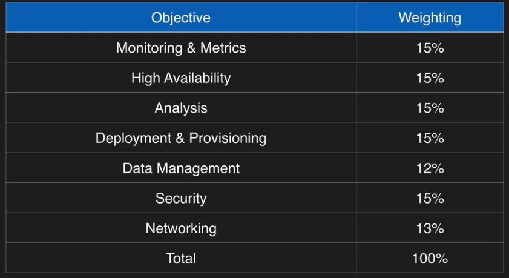

# Exam blueprint

## Whitepapers

AWS Cloud Computing Whitepapers aws.amazon.com/whitepapers:
* Overview of Security Processes
* Storage Options in the Cloud
* Defining Fault Tolerant Applications in the AWS Cloud
* Overview of Amazon Web Services
* Compliance Whitepaper
* Architecting for the AWS Cloud

## Links

- https://aws.amazon.com/certification/certified-sysops-admin-associate/
- http://awstrainingandcertification.s3.amazonaws.com/production/AWS_certified_sysops_associate_blueprint.pdf
- http://jayendrapatil.com/aws-sysops-administrator-associate-exam-learning-path/